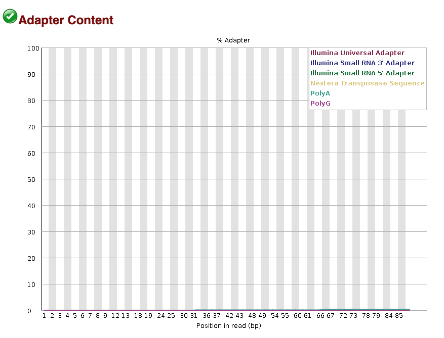
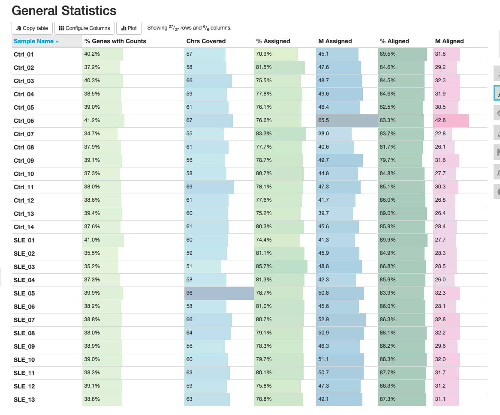
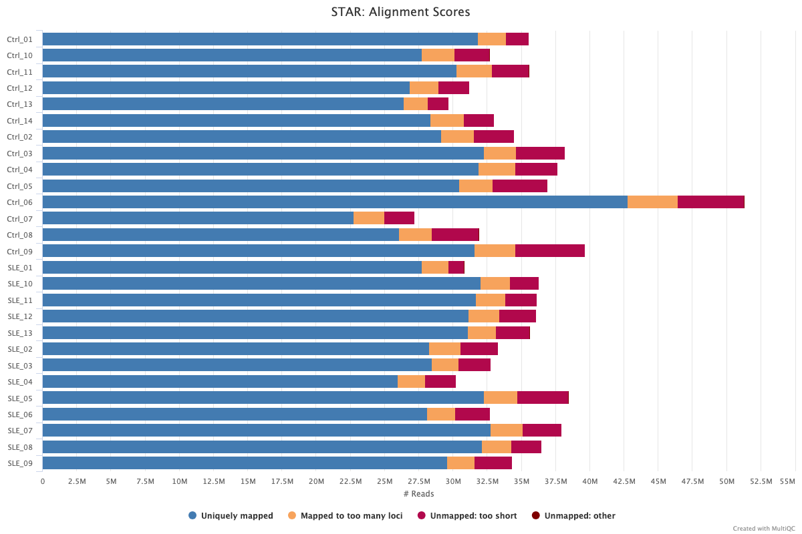
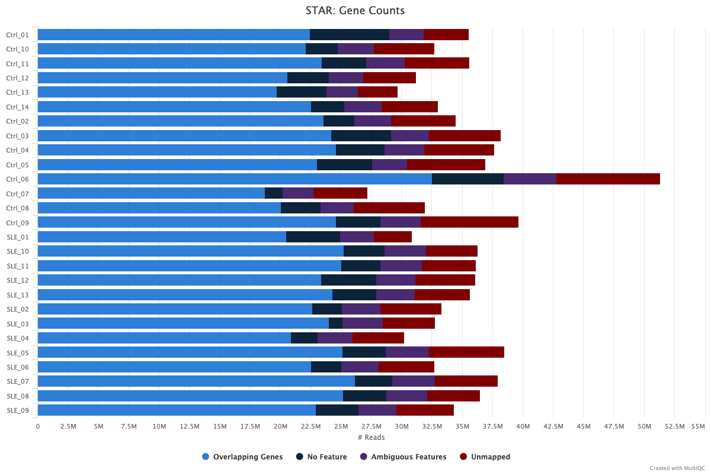
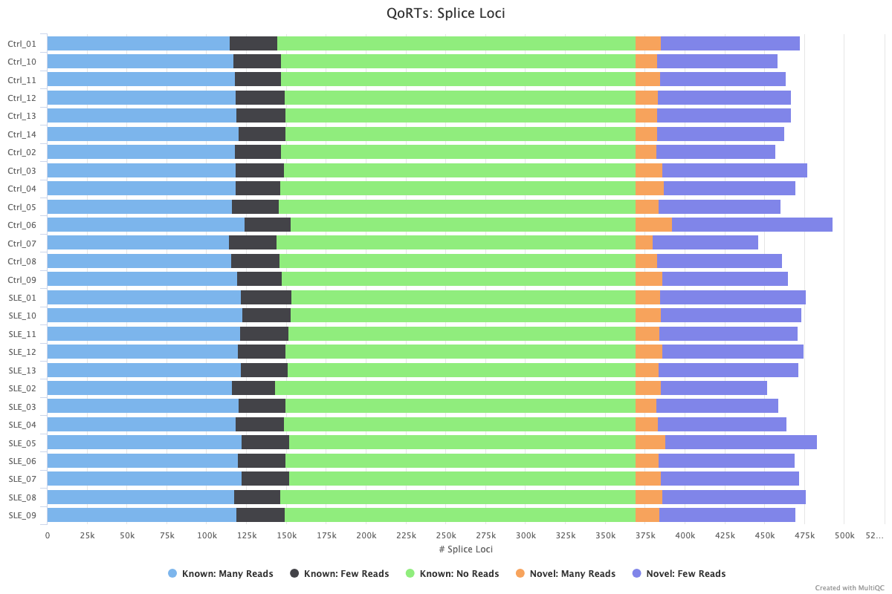
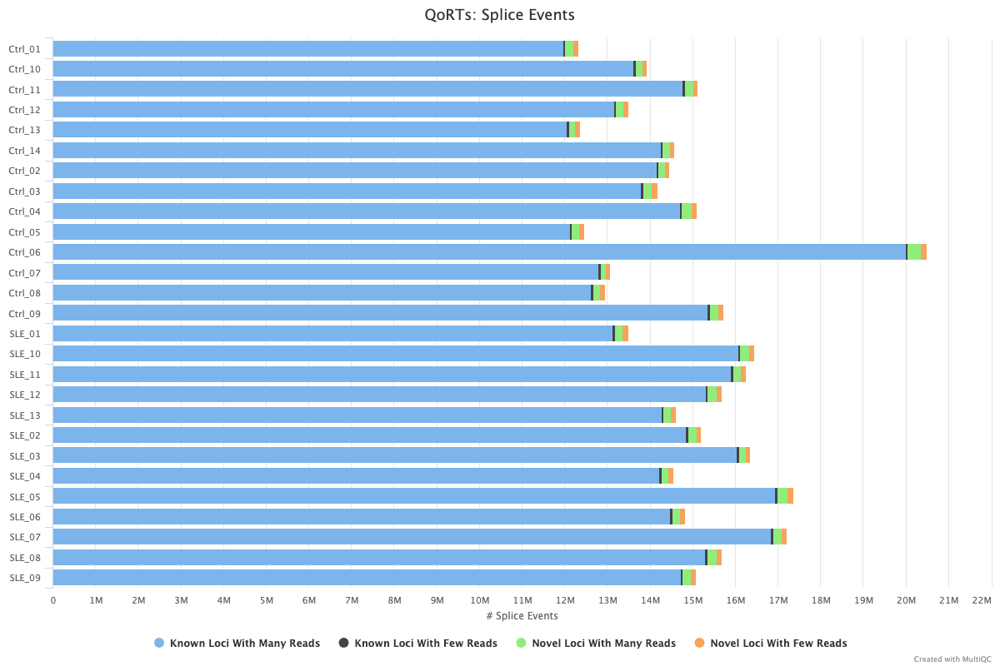
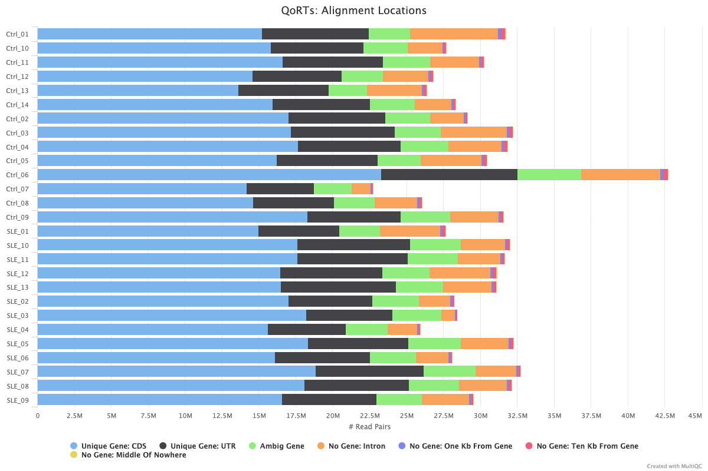
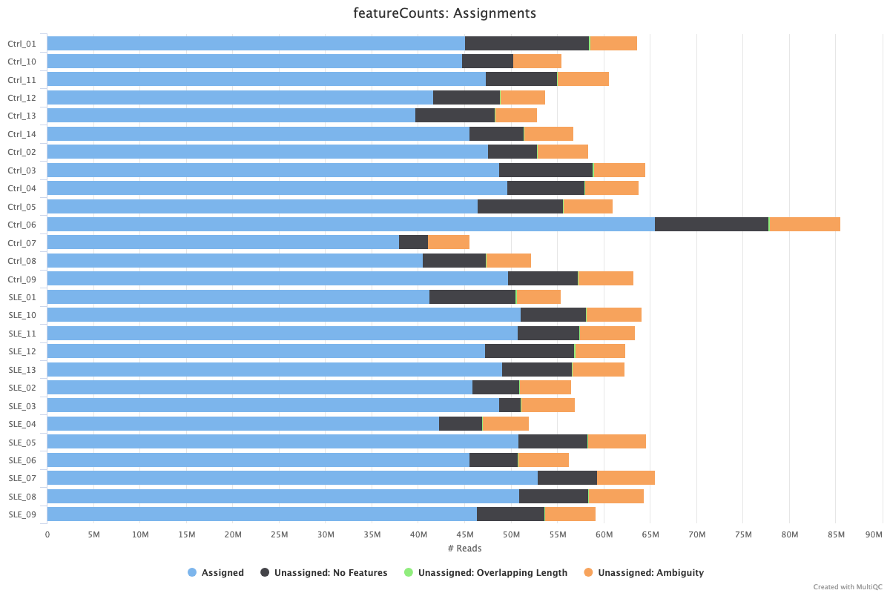

```{r setup, include=FALSE}
knitr::opts_chunk$set(echo = TRUE)
```

```{r message=FALSE, warning=FALSE}
# Loading packages
library(tidyverse)
library(knitr)
library(DESeq2)
library(magrittr)
library(pheatmap)
library(EnhancedVolcano)
library(org.Hs.eg.db)
library(AnnotationDbi)
```

# Project: Align all your samples 

As a reminder, I am examining the RNA-seq data from an experimental group including 14 patients with active SLE (SLE) and 14 healthy controls (Ctrl).

### Align all samples

To understand whether I needed to trim my reads via `trim-galore`, I took a look at the `FastQC` report for Ctl_1.

According to the QC Adapter Content chart below, all lines, representing known adapters, stays at very bottom around ~0%, no adapter trimming is required. Moreover, trimming is not as essential before using STAR because it automatically soft-clips low-quality or adapter-contaminated ends during alignment.

```{r}

```

I therefore move forward with aligning all the reads using STAR. I use the following script to do this. I don't align Ctrl_1 and SLE_1 since I've already done so previously. I make sure to use the same options when using STAR to ensure consistency.

```{bash, eval=FALSE}
#!/bin/bash
#SBATCH --job-name=star_align_raw
#SBATCH --output=star_align_raw.out
#SBATCH --error=star_align_raw.err
#SBATCH --partition=angsd_class
#SBATCH --cpus-per-task=20
#SBATCH --mem=100G
#SBATCH --time=24:00:00

# Activate conda environment
source ~/.bashrc
conda activate angsd

# Define paths
PROJECT_DIR="/athena/angsd/scratch/par4012/project"
DATA_DIR="$PROJECT_DIR/data"
OUT_DIR="$PROJECT_DIR/aligned_reads"
GENOME_DIR="$PROJECT_DIR/reference/STAR_index"

# Align Ctrl_2 to Ctrl_14
for i in {2..14}; do
  FORWARD="${DATA_DIR}/Ctrl_${i}_f.fastq.gz"
  REVERSE="${DATA_DIR}/Ctrl_${i}_r.fastq.gz"
  PREFIX="${OUT_DIR}/Ctrl_${i}_"

  echo "Aligning Ctrl_${i}..."

  STAR --runThreadN 20 \
       --genomeDir $GENOME_DIR \
       --readFilesIn $FORWARD $REVERSE \
       --readFilesCommand zcat \
       --outFileNamePrefix $PREFIX \
       --outSAMtype BAM SortedByCoordinate \
       --quantMode GeneCounts \
       --outFilterMultimapNmax 1 \
       --outFilterMismatchNoverReadLmax 0.04 \
       --alignSJoverhangMin 8
done

# Align SLE_2 to SLE_13
for i in {2..13}; do
  FORWARD="${DATA_DIR}/SLE_${i}_f.fastq.gz"
  REVERSE="${DATA_DIR}/SLE_${i}_r.fastq.gz"
  PREFIX="${OUT_DIR}/SLE_${i}_"

  echo "Aligning SLE_${i}..."

  STAR --runThreadN 20 \
       --genomeDir $GENOME_DIR \
       --readFilesIn $FORWARD $REVERSE \
       --readFilesCommand zcat \
       --outFileNamePrefix $PREFIX \
       --outSAMtype BAM SortedByCoordinate \
       --quantMode GeneCounts \
       --outFilterMultimapNmax 1 \
       --outFilterMismatchNoverReadLmax 0.04 \
       --alignSJoverhangMin 8
done
```

### Alignment QC using QoRTs

I now use `QoRTs` to provide a comprehensive quality control metrics beyond basic alignment stats, including gene body coverage, splice junction annotation, and strand specificity checks. Running it helps ensure that the RNA-seq data is high-quality and suitable for downstream differential expression and splicing analyses. I run QoRTs using the script below, and I will look at the results using `MultiQC` in the next section.

```{bash, eval=FALSE}
#!/bin/bash
#SBATCH --job-name=qorts_all
#SBATCH --output=qorts_all_%j.out
#SBATCH --error=qorts_all_%j.err
#SBATCH --partition=angsd_class
#SBATCH --cpus-per-task=24
#SBATCH --mem=100G
#SBATCH --time=24:00:00

# Activate conda environment
source ~/.bashrc
conda activate qorts

# Define paths
PROJECT_DIR="/athena/angsd/scratch/par4012/project"
BAM_DIR="$PROJECT_DIR/aligned_reads"
GTF="$PROJECT_DIR/reference/gencode.v47.basic.annotation.gtf"
QORTS_JAR="/athena/angsd/scratch/mef3005/share/envs/qorts/share/qorts-1.3.6-1/QoRTs.jar"
QORTS_OUT="$PROJECT_DIR/qorts_out"

# Loop over each BAM file and run QoRTs into its own folder
for bam in "$BAM_DIR"/*.bam; do
  sample=$(basename "$bam" .bam)
  out_dir="$QORTS_OUT/$sample"

  echo "Running QoRTs on $sample..."

  java -Xmx96G -jar "$QORTS_JAR" QC \
    --generatePlots \
    "$bam" \
    "$GTF" \
    "$out_dir"
done
```

### FeatureCounts

Now I want to use `featureCounts` because it efficiently quantifies how many reads align to each gene, producing a gene-level count matrix that’s essential for downstream differential expression analysis. I plan to include this in the `MultiQC` report and use the `txt` to perform downstream analyses. I use the script below to run `featureCounts`:

```{bash, eval=FALSE}
#!/bin/bash
#SBATCH --job-name=featureCounts
#SBATCH --output=featureCounts_%j.out
#SBATCH --error=featureCounts_%j.err
#SBATCH --mem=100G
#SBATCH --cpus-per-task=24
#SBATCH --time=4:00:00

# Load or activate the conda environment if necessary
# module load subread or source activate env
source ~/.bashrc
conda activate angsd

# Define paths
PROJECT_DIR="/athena/angsd/scratch/par4012/project"
ALIGN_DIR="$PROJECT_DIR/aligned_reads"
GTF_FILE="$PROJECT_DIR/reference/gencode.v47.basic.annotation.gtf"
OUTFILE="$PROJECT_DIR/feature_counts/counts.txt"

# Run featureCounts on all Ctrl and SLE BAM files except for Ctrl_1 and SLE_1
featureCounts -T 24 -p \
  -a "$GTF_FILE" \
  -o "$OUTFILE" \
  --minOverlap 10 \
  "$ALIGN_DIR"/Ctrl_*_Aligned.sortedByCoord.out.bam \
  "$ALIGN_DIR"/SLE_*_Aligned.sortedByCoord.out.bam
```

### MultiQC

I now use `MultiQC` to aggregate and summarize output from STAR, featureCounts, and QoRTs into a single, interactive HTML report, which I will include in my project folder. I run `MultiQC` using the below:

```{bash, eval=FALSE}
multiqc /athena/angsd/scratch/par4012/project \
  -o /athena/angsd/scratch/par4012/project/multiqc_report
```

The graphs from MultiQC can be seen below:

```{r}







```

**General Statistics:**
The general statistics table shows high alignment percentages across most samples, with values typically exceeding 80%. The “% Assigned” column—indicating the proportion of reads assigned to genes—hovers between ~70% and ~85%, suggesting strong annotation quality and effective alignment. Most samples cover over 50 chromosomes, ensuring broad genomic coverage. However, there’s some variation in “% Genes with Counts,” with lower values in some SLE samples, such as SLE_03 and SLE_02. This might indicate either lower expression diversity or reduced read depth in these samples.

**STAR QC Metrics:**
The STAR alignment scores plot indicates that the majority of reads across all samples are uniquely mapped (blue), which is expected and ideal. However, samples such as Ctrl_06 show a dramatic drop in uniquely mapped reads with a noticeable increase in “Unmapped: too short” and “Mapped to too many loci,” suggesting poor library complexity. The STAR gene counts bar plot reinforces this by showing elevated “Unmapped” and “Ambiguous Features” counts for Ctrl_06. These outliers need further inspection and could warrant exclusion or additional normalization consideration in downstream analyses.

**QoRTs Quality Control:**
QoRTs’ alignment plot reveals most samples have a healthy distribution of reads mapping to coding regions (CDS) and UTRs, with consistent patterns across replicates. Ctrl_06 once again appears as an anomaly, showing an unusually high proportion of reads aligning to intergenic regions and “No Gene: Middle of Nowhere,” reinforcing its potential quality issues. The splice loci panel shows consistent read support across known splice junctions in most samples, with SLE and Ctrl groups displaying very similar profiles—indicative of standardized library prep and accurate annotation. Similarly, the splice events graph demonstrates a predominance of “Known Loci With Many Reads,” suggesting good splicing event coverage across all samples.

**featureCounts:**
The featureCounts plot highlights the proportion of assigned reads relative to various sources of unassignment. Most samples show robust assignment (light blue), although variability exists in ambiguity and overlapping reads. Ctrl_06 stands out once more with a sharp drop in assigned reads and a spike in unassigned reads due to ambiguous or no features. This again flags it as a likely outlier, potentially due to library prep issues or annotation mismatches. Overall, featureCounts confirms that the data is largely high quality, but careful attention should be paid to outlier samples before differential gene expression analysis.

### Read Count Table and Subsequent Processes

I read the featureCounts table into R using the following:

```{r}
# Read the raw count matrix
count_data <- read.delim("counts.txt", comment.char = "#")

# Clean up the gene annotation
rownames(count_data) <- count_data$Geneid
count_data <- count_data[, -(1:6)]  # remove annotation columns

# Check column names
colnames(count_data) <- gsub(".bam", "", colnames(count_data))  # simplify sample names
```

I use Regex to shorten my sample names and specify condition:

```{r}
colnames(count_data) <- gsub(".*aligned_reads\\.(.*)_Aligned.*", "\\1", colnames(count_data))
sample_names <- colnames(count_data)
condition <- ifelse(grepl("Ctrl", sample_names), "Ctrl", "SLE")
col_data <- data.frame(row.names = sample_names, condition = factor(condition, levels = c("Ctrl", "SLE")))
```

I create DESeq2 and Normalize:

```{r}
dds <- DESeqDataSetFromMatrix(countData = count_data, colData = col_data, design = ~ condition)
dds <- DESeq(dds)
```
```{r}
colnames(count_data)
```

Perfomring exploratory data analysis by looking at rlog transformation, a correlation heatmap, and PCA:

```{r}
# rlog transformation
rld <- rlog(dds)

# Correlation heatmap
cor_matrix <- cor(assay(rld))
pheatmap(cor_matrix, main = "Sample Correlation Heatmap")

# PCA
plotPCA(rld, intgroup = "condition") + ggtitle("PCA: Ctrl vs SLE")
```

The sample correlation heatmap displays the pairwise correlation between all samples based on their gene expression profiles. From this heatmap, we observe that most samples show high overall correlation (values close to 1, indicated by red), suggesting good data quality. However, the clustering of samples reveals biological and technical distinctions. For example, many Ctrl samples cluster together, and many SLE samples cluster together as well, though with some intermingling. This suggests some degree of biological similarity within conditions, but also potential variability due to biological heterogeneity or technical artifacts.

The PCA (Principal Component Analysis) plot provides a complementary view, projecting the high-dimensional expression data into two dimensions that capture the most variance. Here, we see a clearer separation between Ctrl and SLE groups along PC1, which accounts for 35% of the variance. This indicates that the main source of variation in the data distinguishes control and disease states, suggesting biologically meaningful differences in gene expression. PC2 accounts for a smaller portion (17%) of variance, and within-group spread is more pronounced for SLE samples, possibly reflecting more heterogeneity among those samples. Together, these plots provide strong evidence for differential expression between Ctrl and SLE conditions and suggest the dataset is suitable for downstream analysis.

I now extract the DE results below, emplying shrinkage to assess effect sizes better.

```{r}
res <- results(dds, alpha = 0.05)
summary(res)
```
Mapping Ensembl IDs to gene symbols using a gene annotation database (org.Hs.eg.db)

```{r fig.height=8, fig.width=10, message=FALSE, warning=FALSE}
# Remove version numbers (e.g., ENSG000001234.5 → ENSG000001234)
rownames(res) <- gsub("\\.\\d+$", "", rownames(res))

# Make sure res rownames are Ensembl IDs
ensembl_ids <- rownames(res)

# Create a lookup table
gene_symbols <- AnnotationDbi::select(
  org.Hs.eg.db,
  keys = ensembl_ids,
  columns = c("SYMBOL"),
  keytype = "ENSEMBL"
)

# Remove duplicates to keep only one mapping per Ensembl ID
gene_symbols_unique <- gene_symbols[!duplicated(gene_symbols$ENSEMBL), ]

# Merge gene symbols back into your DESeq2 results object
res$symbol <- gene_symbols_unique$SYMBOL[match(rownames(res), gene_symbols_unique$ENSEMBL)]
```

Making MA plot and volcano plot

```{r, fig.width=10, fig.height=8}
# MA Plot
plotMA(res, ylim = c(-4, 4))

# Volcano plot
EnhancedVolcano(res,
                lab = res$symbol,
                x = "log2FoldChange",
                y = "padj",
                pCutoff = 0.05,
                FCcutoff = 1,
                ylim = c(0, 25),
                title = "Differential Expression: SLE vs Ctrl")
```

The MA plot (top) and volcano plot (bottom) provide a powerful overview of the differential gene expression between systemic lupus erythematosus (SLE) patients and healthy controls. These samples, from the GEO dataset GSE97263, were derived from CD16⁺ monocytes—a subset of immune cells involved in innate immune responses. In the MA plot, genes are plotted by their mean normalized expression (x-axis) and their log₂ fold change (y-axis). The majority of genes center around a log₂ fold change of zero, indicating no expression difference, but a notable cluster of blue points (significantly differentially expressed genes) appears above and below the center line, especially at higher expression levels. This pattern suggests reliable and biologically meaningful differences in gene expression between the two conditions, despite some noise at the low-count end of the spectrum.

The volcano plot further sharpens the focus by highlighting genes with both statistical significance and biologically meaningful fold changes. Genes with both low p-values and large fold changes (in red) populate the top corners of the plot, representing strong candidates for SLE-associated differential expression. Notably, several interferon-stimulated genes like ISG15, IFI44, IFI44L, and USP18 show elevated expression in SLE monocytes, consistent with the interferon signature previously reported in autoimmune diseases. These findings reinforce the known role of type I interferon responses in SLE pathogenesis and highlight the usefulness of transcriptomic profiling to uncover immune dysregulation in disease states.