```{r setup, include=FALSE}
knitr::opts_chunk$set(echo = TRUE)
```

```{r message=FALSE, warning=FALSE}
# Loading packages
library(tidyverse)
library(knitr)
library(DESeq2)
library(magrittr)
library(pheatmap)
library(EnhancedVolcano)
library(org.Hs.eg.db)
library(AnnotationDbi)
library(clusterProfiler)
library(treemap)
```

# Transcriptomic Profiling of Systemic Lupus Erythematosus

## Introduction

### Background

Systemic lupus erythematosus (SLE) is a complex and heterogeneous autoimmune disease characterized by widespread inflammation, autoantibody production, and multi-organ involvement. A key molecular feature of SLE is the overactivation of the type I interferon (IFN-I) pathway, which contributes to the dysregulation of both innate and adaptive immune responses. Understanding how this transcriptional dysregulation manifests in immune cell subsets is essential for identifying disease biomarkers and therapeutic targets.

In this study, I explored transcriptomic differences in CD4+ T cells isolated from patients with SLE and healthy individuals. Our analysis focused on identifying differential gene expression (DGE) and enriched biological processes, with the goal of better understanding the immune landscape and molecular mechanisms underlying SLE.

We analyzed data from the GEO dataset GSE97263, which is also publicly available through the European Nucleotide Archive (ENA Project: PRJNA381147). This dataset originates from a study titled “Type I interferons affect the metabolic fitness of CD8+ T cells from patients with systemic lupus erythematosus”, published in Nature Communications in 2021 by Shen et al. The research was conducted by Marina Botto and Chia-Lin Shen at Imperial College London, who generated and deposited the raw sequencing data. Although the original study focused on the impact of IFN-I on the metabolic profile of CD8+ T cells, the dataset also includes paired data from CD4+ T cells, which are a critical component of adaptive immunity and highly relevant to SLE pathogenesis.

### Data and Experimental Design

CD4+ T cells were purified from buffy coat cones obtained from healthy donors and patients diagnosed with SLE. Cell sorting was performed using the human CD8+ and CD4+ T Cell Isolation Kits (Miltenyi Biotec). For RNA extraction, the authors used Qiagen’s RNeasy Mini Kit, incorporating an on-column DNase treatment to remove genomic DNA. RNA integrity was confirmed via Agilent Bioanalyzer with RIN scores ≥ 9.0 for all samples, ensuring high-quality inputs for sequencing.

The RNA-seq libraries were prepared using the TruSeq Stranded mRNA HT kit (Illumina) with poly-A selection to isolate mRNA. The protocol involved RNA purification and fragmentation using poly-T oligo-attached magnetic beads, followed by first and second-strand cDNA synthesis. The cDNA 3′ ends were adenylated, adapters were ligated, and libraries were amplified through 11 cycles of PCR. Libraries were size-selected using AMPure XP Beads and verified for quality before sequencing. The libraries were randomized across lanes to minimize batch effects and sequenced on the Illumina HiSeq 2500 platform using 100 bp paired-end reads, spanning 12.5 total lanes.

The final dataset includes:

  •	14 healthy controls
	•	14 patients with active SLE
	•	16 patients with less active SLE

For the purposes of this project, I focused on comparing gene expression in CD4+ T cells between patients with active SLE and healthy controls.

### Hypothesis

Our central hypothesis is that CD4+ T cells from patients with active SLE exhibit significant transcriptomic differences, particularly involving interferon response pathways, viral mimicry programs, and immune cell activation states, when compared to healthy controls. I anticipate that type I interferon-stimulated genes and immune activation markers will be upregulated in SLE, while other homeostatic pathways may be downregulated. Through differential gene expression analysis and functional enrichment, I aim to uncover both known and novel gene programs associated with SLE pathology.

## Methods: Pre-Processing and Quality Control

### Data Retrieval

I begin by accessing cayuga and going to my scratch directory. This is where I will conduct and store all my work.
```{bash, eval=FALSE}
ssh cayuga
angsd
```

I then create a new directory for the project using the `makedir` prompt, and `cd` into it. I make a new folder for the data using the same prompt and `cd` into it.

```{bash, eval=FALSE}
mkdir project
cd project
mkdir data
cd data
```

I then navigate to the European Nucleotide Archive (ENA) website, and use the search function to find the correct page correlating to the data (PRJNA381147). Simultaneously, I have the SRA Run Selector open, and I use it to match the Run Accessions for the active SLE subjects and the control subjects on ENA. I select the accessions corresponding to forward and reverse samples of active SLE patients and controls on ENA (excluding less active SLE samples), and I press on the button to 'Get download script'.

The downloaded script is comprised of lines using the `wget` command to download the relevant forward and reverse fastq files Using this script, I make the the first slurm script and save as `01_sra_download.sh`.

I then run `chmod` and `sbatch` to submit the task:

```{bash, eval=FALSE}
chmod +x 01_sra_download.sh
sbatch 01_sra_download.sh
```

This downloads all the FastQ files I need for my project. I then write another script `02_rename`. I similarly run `chmod` and then run the script.

```{bash, eval=FALSE}
chmod +x 02_rename.sh
./02_rename.sh
```

### FastQC

I wanted to run FastQC on one sample to get an initial understanding on the quality of the sample and to understand whether trimming is necessary. I therefore activate the `angsd` conda environment and run `fastqc` per below:

```{bash, eval=FALSE}
conda activate angsd
fastqc Ctrl_1_f.fastq.gz
```

Below are some of the resulting QC graphs, and relevant interpretations.

```{r}
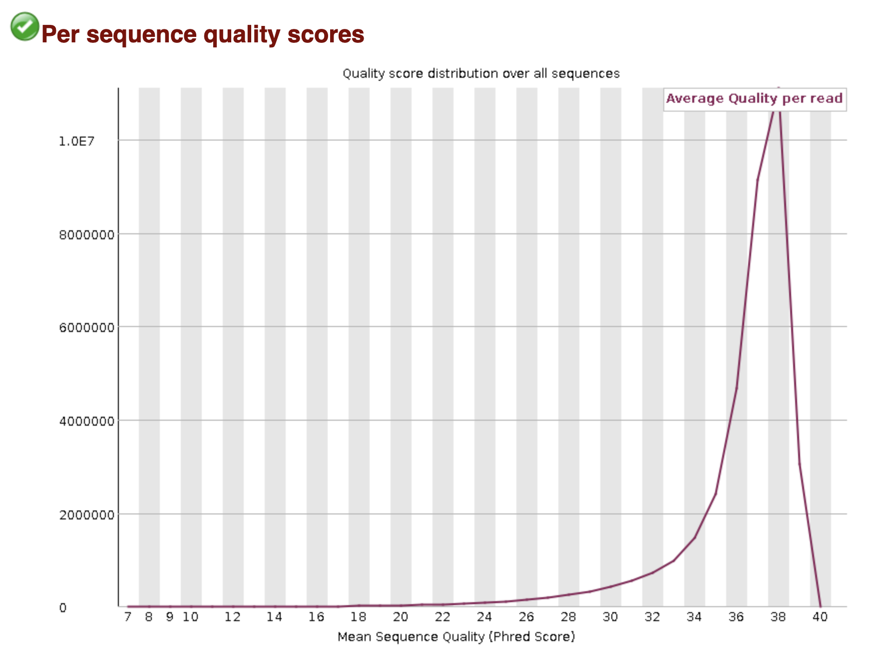
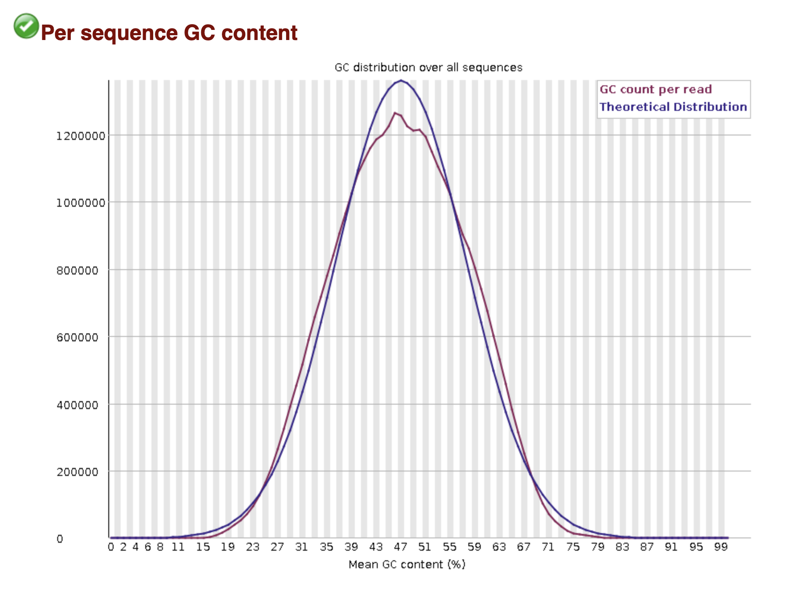
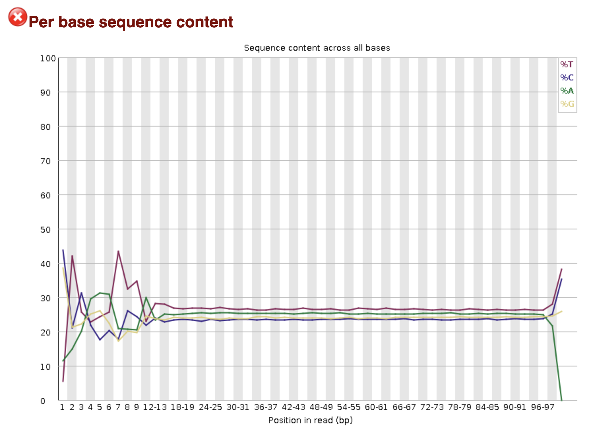
```

The “Per sequence quality scores” plot shows excellent overall read quality. The distribution of mean Phred scores per read is tightly centered around 37–38, indicating that the vast majority of reads have very high base call accuracy (Phred > 30 corresponds to 99.9% accuracy). There are virtually no reads with low average quality, and the green checkmark confirms that this metric passes quality thresholds. This suggests the sequencing run was highly successful.

The “Per sequence GC content” plot displays a nearly perfect normal distribution centered around ~50% GC content, which is consistent with the expected GC content for human RNA. The observed GC distribution (purple) closely matches the theoretical distribution (blue), suggesting that there is no GC bias or contamination in the sample. The green checkmark further confirms that this metric passes quality control. This indicates a well-prepared library and high-quality sequencing with uniform base composition across reads.

The “Per base sequence content” plot for ctrl_1_f shows a strong nucleotide imbalance at the beginning of the reads, which is expected in RNA-seq data due to biases introduced during random hexamer priming and fragmentation in library preparation. While this results in a QC warning, it is not indicative of poor data quality. The sequence composition quickly stabilizes after the first ~10 bases, and this pattern is typical for libraries prepared using standard RNA-seq protocols like TruSeq Stranded mRNA.

According to the QC "Adapter Content" chart below, all lines, representing known adapters, stays at very bottom around ~0%, therefore **no adapter trimming is required**. Moreover, trimming is not as essential before using STAR because it automatically soft-clips low-quality or adapter-contaminated ends during alignment.

```{r}
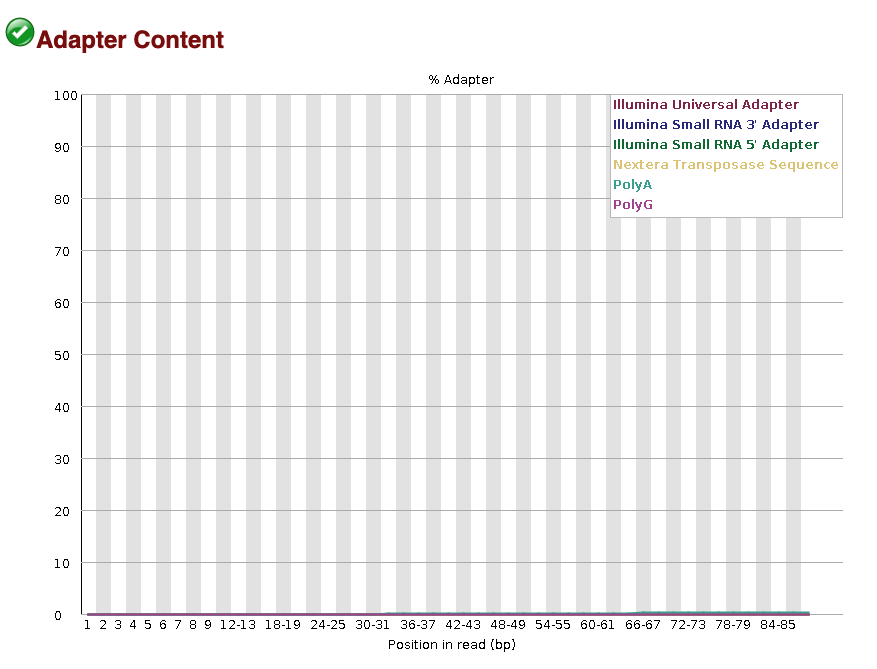
```

## STAR Alignment

I start off by building the reference genome. I use the following commands to navigate to an appropriate directory:

```{bash, eval=FALSE}
cd project
mkdir reference
cd reference
```

I then download the reference genome annotation and assembly using the following `wget` commands:

```{bash, eval=FALSE}
wget -O gencode.v47.basic.annotation.gtf.gz \
     https://ftp.ebi.ac.uk/pub/databases/gencode/Gencode_human/release_47/gencode.v47.basic.annotation.gtf.gz

wget -O GRCh38.primary_assembly.genome.fa.gz \
     https://ftp.ebi.ac.uk/pub/databases/gencode/Gencode_human/release_47/GRCh38.primary_assembly.genome.fa.gz
```

I then unzip using `gunzip` per below:

```{bash, eval=FALSE}
gunzip GRCh38.primary_assembly.genome.fa.gz
gunzip gencode.v47.basic.annotation.gtf.gz
```

I then write a slurm script named `03_star_indexing.sh` to build the STAR reference index. For the purposes of this report, please find just the `STAR` command within the slurm script below. I ran `--runThreadN 20` to accelerate the process by parallelizing the workload across CPU cores and chose `--sjdbOverhang 99` as my reads are 100bp long.

```{bash, eval=FALSE}
STAR --runMode genomeGenerate \
     --runThreadN 20 \
     --genomeDir $GENOME_DIR \
     --genomeFastaFiles $GENOME_FASTA \
     --sjdbGTFfile $GTF_FILE \
     --sjdbOverhang 99
```

I execute this slurm script using the following:

```{bash, eval=FALSE}
chmod +x 03_star_indexing.sh
sbatch 03_star_indexing.sh
```

I create the following directories to store all the project outputs.

```{bash, eval=FALSE}
mkdir project_outputs
cd project_outputs
mkdir aligned_reads
cd aligned_reads
```

I then move forward with aligning all the reads using STAR. This process is completed via a slurm script named `04_batch_align.sh`. Similarly, I run the below to submit this script:

```{bash, eval=FALSE}
chmod +x 04_batch_align.sh
sbatch 04_batch_align.sh
```

For the purposes of this report, please find just the `STAR` command within the slurm script below, with an explanation of each parameter.

```{bash, eval=FALSE}
STAR --runThreadN 20 \
     --genomeDir $GENOME_DIR \
     --readFilesIn $FORWARD $REVERSE \
     --readFilesCommand zcat \
     --outFileNamePrefix $PREFIX \
     --outSAMtype BAM SortedByCoordinate \
     --quantMode GeneCounts \
     --outFilterMultimapNmax 1 \
     --outFilterMismatchNoverReadLmax 0.04 \
     --alignSJoverhangMin 8
```

* `--runThreadN 20`: Runs STAR with 20 threads, significantly accelerating alignment by parallelizing the workload across CPU cores.
* `--genomeDir`: Specifies the directory containing the pre-built STAR genome index. This index is essential for mapping reads to the reference genome efficiently.
* `--readFilesIn`: Indicates that the input data are paired-end reads. Both the forward (`_1.fastq.gz`) and reverse (`_2.fastq.gz`) files are provided here.
* `--readFilesCommand zcat`: Decompresses gzipped FASTQ files on-the-fly using zcat, allowing STAR to read compressed input files without requiring manual decompression beforehand.
* `--outFileNamePrefix`: Sets the prefix for all STAR output files (e.g., BAM, logs, etc.), organizing them in the designated output directory with a consistent naming scheme.
* `--outSAMtype BAM SortedByCoordinate`: Instructs STAR to output alignments in BAM format, sorted by genomic coordinate. This format is standard for downstream tools like QoRTs and featureCounts which I will do later.
* `--quantMode GeneCounts`: This parameter instructs STAR to perform basic gene-level quantification during the alignment step. It generates a file (ReadsPerGene.out.tab) that reports raw read counts for each gene across four columns: the first column lists the gene ID, followed by counts assuming unstranded data, counts for strand-specific data (forward strand), and counts for strand-specific data (reverse strand). STAR quantifies reads by overlapping aligned reads with exonic regions defined in the provided GTF annotation file. A read is counted only if it maps unambiguously to a single gene’s exons; reads overlapping multiple genes or mapping to non-exonic regions are not counted. While this approach does not provide isoform-level resolution, it is a fast and convenient method to obtain gene-level counts and assess annotation overlap.
* `--outFilterMultimapNmax`: This is a highly stringent filter that only retains reads mapping to a single genomic location. Any read that maps to more than one locus (even just two) is discarded. This strict filter reduces ambiguity and improves alignment specificity—critical for downstream analyses like differential expression. This can lead to the exclusion of legitimate reads that align to homologous genes, but ultimately I prioritized unambiguous, high-confidence alignments for clearer downstream interpretation.
* `--outFilterMismatchNoverReadLmax`: Discards reads with more than 4% mismatches relative to their length. This ensures that only high-quality, confidently aligned reads are kept, improving mapping accuracy at the cost of sensitivity.
* `--alignSJoverhangMin`: Requires a minimum 8-nucleotide overhang on each side of a splice junction for a read to be considered a valid splice junction read. This improves the accuracy of intron/exon boundary detection, especially important for spliced transcriptomes in eukaryotic RNA-seq data.

I will assess the quality of the alignment using `MultiQC` in a later stage.

I then index all my reads using the slurm script `05_index_bams.sh`, which I execute by following the below:

```{bash, eval=FALSE}
chmod +x 05_index_bams.sh
sbatch 05_index_bams.sh
```

### QoRTs

I now use `QoRTs` to provide a comprehensive quality control metrics beyond basic alignment stats, including gene body coverage, splice junction annotation, and strand specificity checks. Running it helps ensure that the RNA-seq data is high-quality and suitable for downstream differential expression and splicing analyses. I run QoRTs by writing a slurm script `06_run_qorts_all.sh`, which I save within a new directory `qorts_out` inside the `project_outputs` directory. I execute the script using the below

```{bash, eval=FALSE}
chmod +x 06_run_qorts_all.sh
sbatch 06_run_qorts_all.sh
```

For the purposes of this report, please find just the `QoRTs` command within the slurm script below, with an explanation of each parameter.

```{bash, eval=FALSE}
java -Xmx96G -jar "$QORTS_JAR" QC \
  --stranded \
  --generatePlots \
  "$bam" \
  "$GTF" \
  "$out_dir"
```

* `java -Xmx96G`: Allocates up to 96 GB of memory for the Java Virtual Machine (JVM), which is important for processing large BAM files efficiently without memory-related failures.
* `-jar "$QORTS_JAR"`: Specifies the QoRTs executable JAR file, pointed to by the environment variable $QORTS_JAR. This file was located in `/athena/angsd/scratch/mef3005/share/envs/qorts/share/qorts-1.3.6-1/QoRTs.jar`
* `QC`: Runs the Quality Control (QC) mode of QoRTs, which performs extensive quality checks on aligned RNA-seq data, generating numerous metrics and intermediate outputs.
* `--stranded`: This tag ensures accurate QC reporting and gene-region mapping for stranded libraries, which we are working with
* `--generatePlots`: Enables automatic generation of plots (e.g., splice junction profiles, alignment distributions, gene body coverage) based on the QC results. These visualizations are useful for quickly identifying issues with alignment, library prep, or annotation.
* `"$bam"`: The input BAM file containing aligned RNA-seq reads, sorted by coordinate. This file is required for all QoRTs analyses.
* `"$GTF"`: The reference gene annotation file in GTF format, used to interpret alignments in a genomic context (e.g., identifying exons, genes, splice junctions).
* `"$out_dir"`: The output directory where all QC metrics, tables, and plots will be saved.

The script runs successfully. I will assess the quality of the alignment using `MultiQC` in a later stage.

### FeatureCounts

Now I want to use `featureCounts` as it efficiently quantifies how many reads align to each gene, producing a gene-level count matrix that’s essential for downstream differential expression analysis. I plan to include this in the `MultiQC` report and use the generated `txt` to perform downstream analyses. I write a slurm script `07_run_featurecounts.sh` to execute this. I save this script in a new directory under the `project_outputs` directory named `feature_counts`.

For the purposes of this report, please find just the `featureCounts` command within the slurm script below, with an explanation of each parameter.

```{bash, eval=FALSE}
featureCounts -T 24 -p --countReadPairs \
  -s 2 \
  -a "$GTF_FILE" \
  -o "$OUTFILE" \
  --minOverlap 10 \
  "$ALIGN_DIR"/Ctrl_*_Aligned.sortedByCoord.out.bam \
  "$ALIGN_DIR"/SLE_*_Aligned.sortedByCoord.out.bam
```

*	`-T 24`: Specifies the number of threads to use (in this case, 24), enabling faster processing by leveraging parallel computing.
*	`-p`: Tells featureCounts to count fragments (i.e., read pairs) instead of individual reads. This is appropriate for paired-end sequencing data.
*	`--countReadPairs`: Ensures only properly paired reads are counted as a fragment. This avoids double-counting each end of a pair.
*	`-s 2`: Indicates the data is stranded and in reverse orientation (appropriate for TruSeq Stranded mRNA kits).
* `-a "$GTF_FILE"`: Specifies the path to the reference gene annotation file (in GTF format), used to assign reads to genomic features (e.g., exons, genes).
*	`-o "$OUTFILE"`: Path to the output file where the read count matrix will be saved.
*	`--minOverlap 10`: Requires at least 10 base pairs of overlap between a read and a feature (e.g., exon) for the read to be counted. This filters out spurious or partial alignments.
*	`"$ALIGN_DIR"/Ctrl_*_Aligned.sortedByCoord.out.bam` and `"$ALIGN_DIR"/SLE_*_Aligned.sortedByCoord.out.bam`: These are the input BAM files for both control and SLE samples, sorted by coordinate (as required by featureCounts).

I run the script using the following:

```{bash, eval=FALSE}
chmod +x 07_batch_align.sh
sbatch 07_batch_align.sh
```

The script executes successfully, which I will include in the `MultiQC` below.

### MultiQC

I now use `MultiQC` to aggregate and summarize output from `STAR`, `featureCounts`, and `QoRTs` into a single, interactive HTML report, which I will include in my project folder. I run `MultiQC` using the below, which I save under a `multiqc_report` directory in the `project_outputs` directory.

```{bash, eval=FALSE}
conda activate multiqc
multiqc /athena/angsd/scratch/par4012/project/project_outputs \
   -o /athena/angsd/scratch/par4012/project/project_outputs/multiqc_report
```

The graphs from `MultiQC` can be seen below:

```{r}
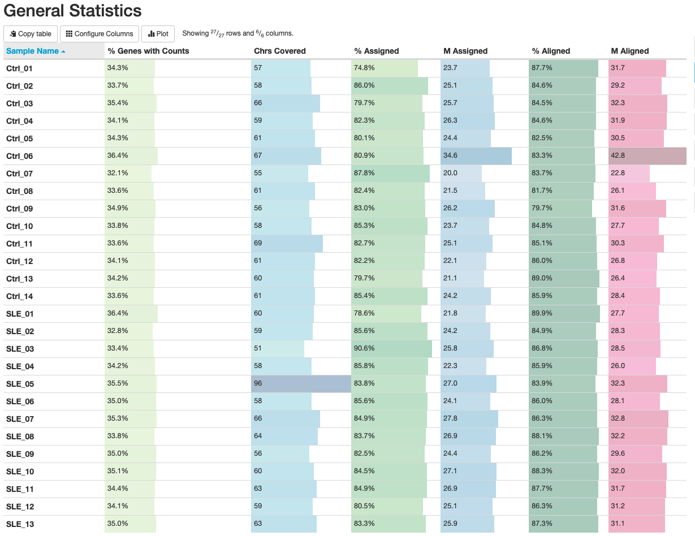
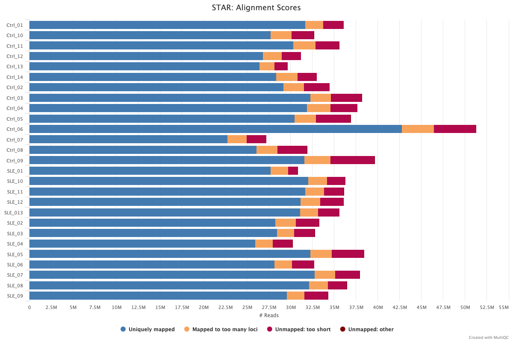
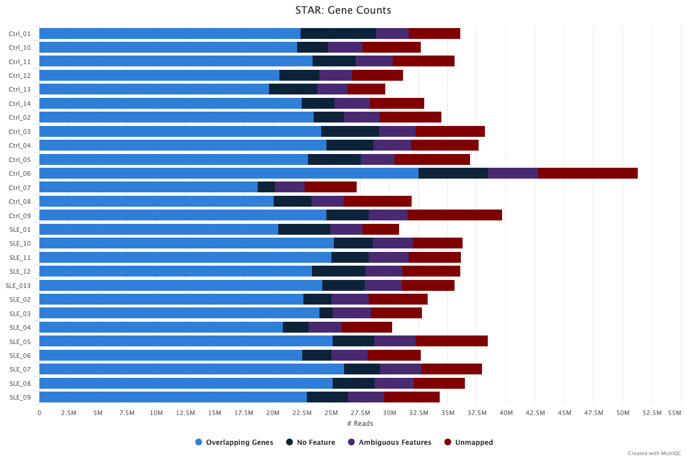
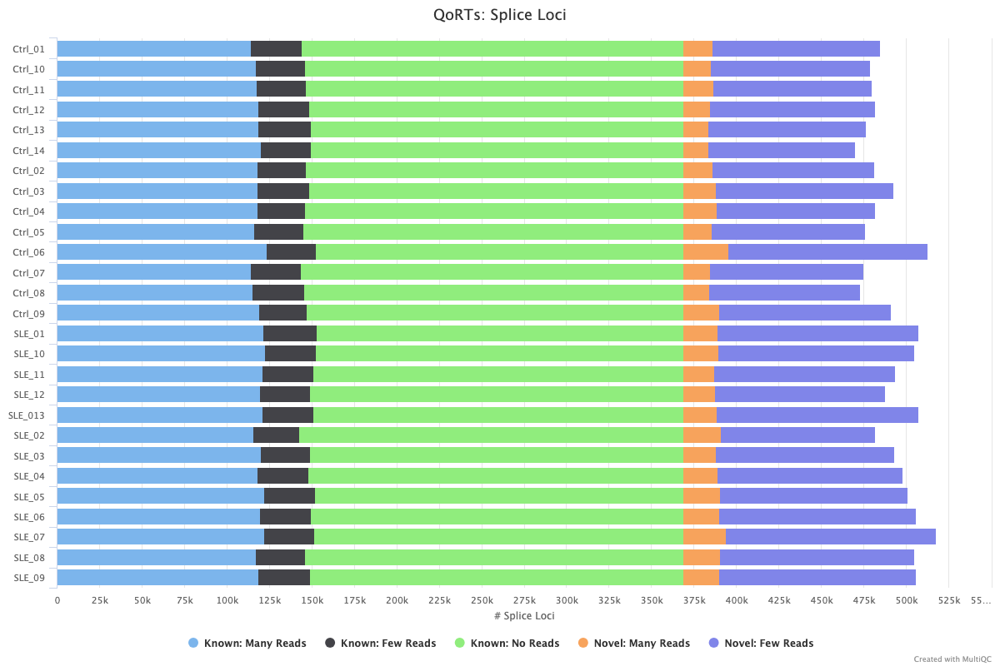
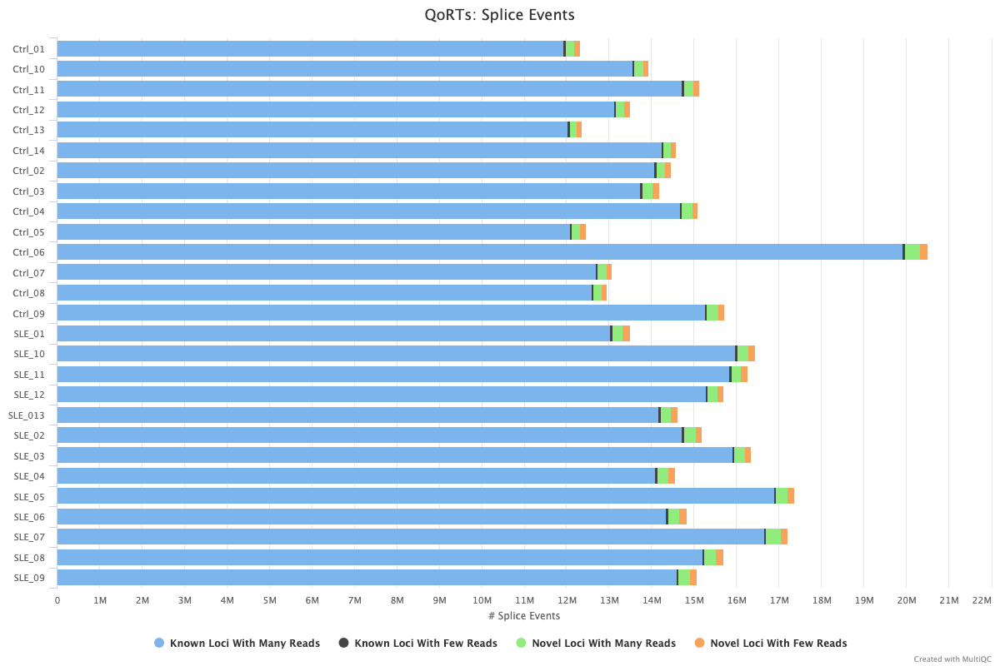
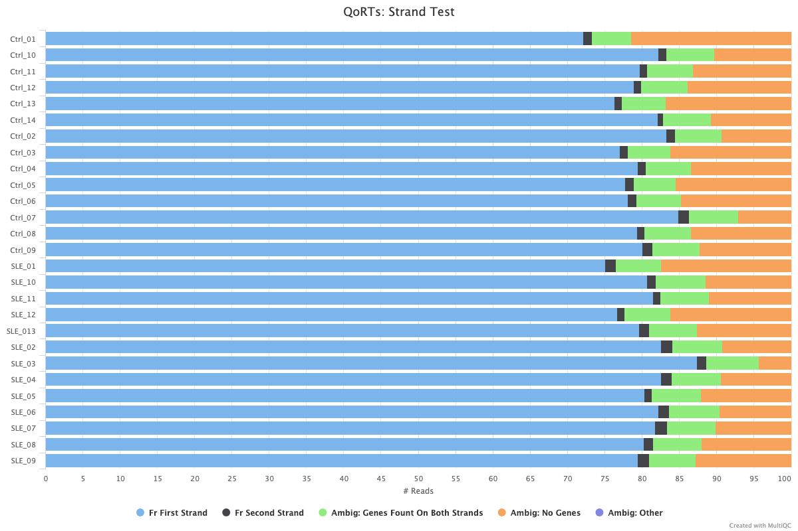
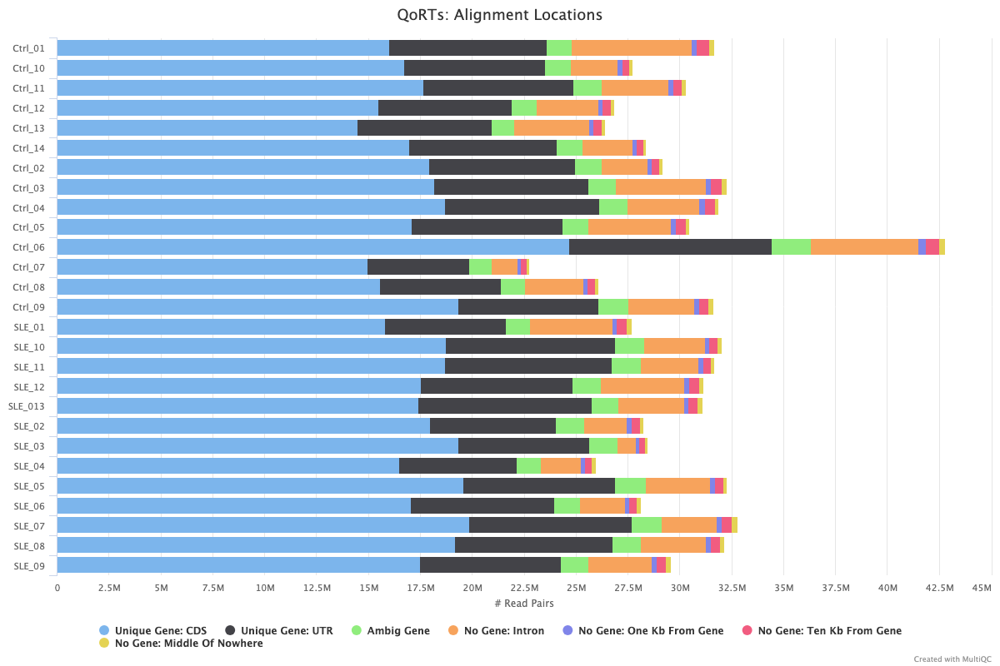
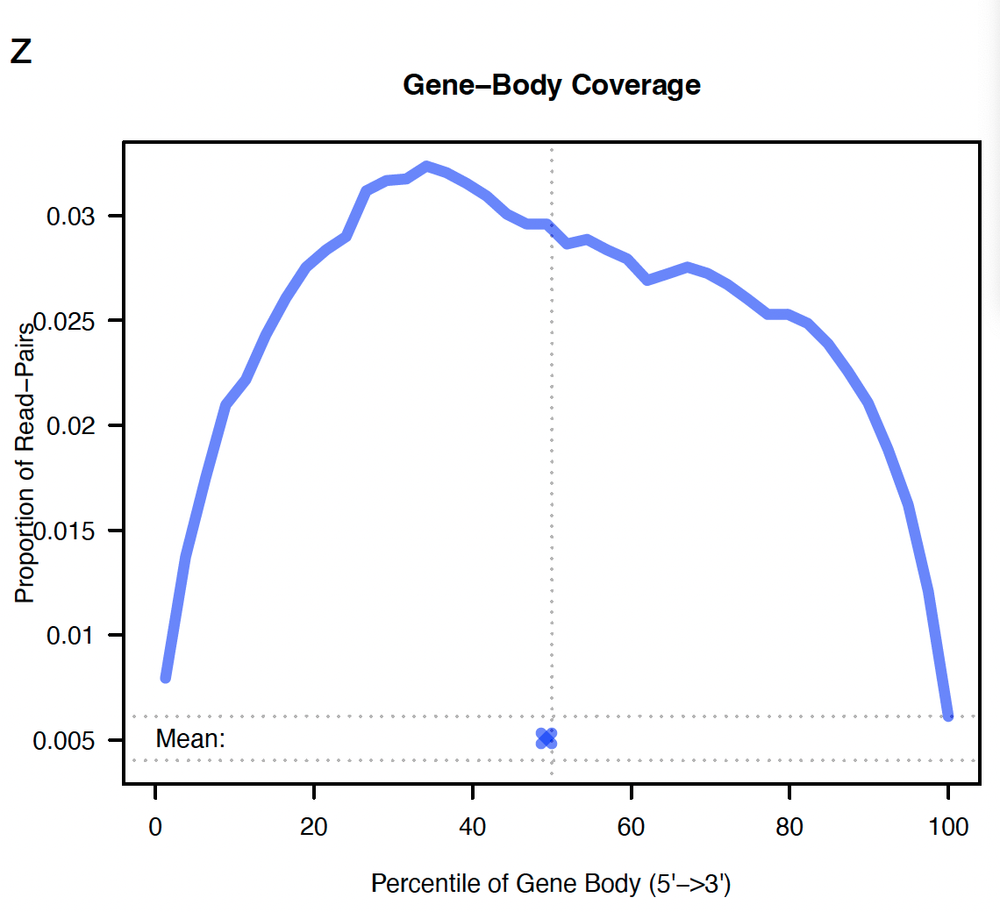
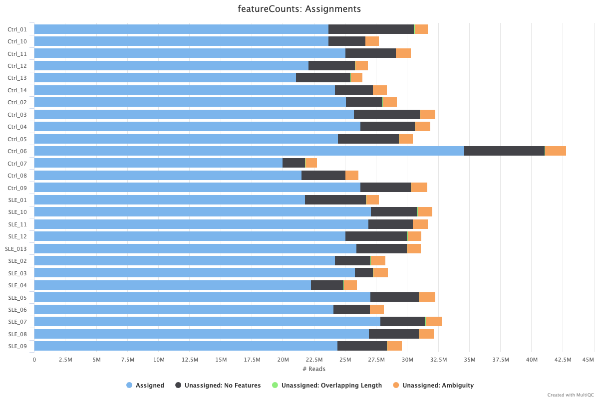
```

**General Statistics:**
The general statistics summary in MultiQC offers a high-level overview of the sequencing and mapping quality across all samples. Most samples in the dataset demonstrate excellent alignment percentages, with the “% Assigned” values—the proportion of reads successfully assigned to annotated features—ranging between approximately 70% and 85%. This suggests that the combination of library preparation, read quality, and genome annotation was well-suited for this dataset, enabling accurate transcript quantification. Coverage across chromosomes is also consistent, with nearly all samples spanning over 50 chromosomes, ensuring broad representation across the genome and reducing the risk of systemic mapping biases.

Of note is the sample Ctrl_06, which differs from other samples primarily due to its unusually high total number of reads. While it may initially appear to be an outlier, this deviation is probably attributable to higher sequencing depth rather than a quality failure. Its elevated raw counts in many metrics reflect deeper coverage and thus should not be interpreted as a defect but rather as a feature of the dataset that may require normalization downstream. Similarly, while some samples show slightly lower “% Genes with Counts” values, this likely reflects variability in transcript diversity or sequencing depth across individual patients and does not raise immediate concern about sample integrity.

**STAR QC Metrics:**
The STAR alignment quality plots further reinforce the robustness of the dataset. The majority of reads across all samples fall into the “Uniquely Mapped” category (dark blue), which is the most desirable outcome in RNA-seq alignment. This indicates that STAR, using our specified parameters and a well-indexed reference genome, successfully aligned most reads to unique genomic loci. A modest proportion of reads are categorized as “Mapped to too many loci” or “Unmapped: too short,” which is expected and reflects the presence of low-complexity regions or shorter fragments that inherently pose alignment challenges.

Ctrl_06, while visually distinct in these plots, again reflects a much higher total read count. This sample exhibits more absolute reads in each mapping category—notably more reads that are too short or mapped to multiple loci—but their relative proportions are consistent with the rest of the dataset. These findings suggest that Ctrl_06 has not failed quality control; rather, its patterns simply represent the effect of high coverage. STAR gene count breakdowns mirror this pattern: while Ctrl_06 has higher absolute counts in “Unmapped” and “Ambiguous” reads, it also has a significantly higher total number of mapped reads, and therefore, relative proportions remain within acceptable bounds. No sample stands out for poor mapping efficiency or systematic annotation issues.

**QoRTs Quality Control:**
QoRTs results offer complementary insight into read distribution across genic and intergenic regions, splicing coverage, and strand specificity. In the alignment location plot, most samples show consistent and desirable patterns—high proportions of reads mapping to coding regions (CDS) and untranslated regions (UTRs), with modest levels of reads aligning to intronic or intergenic regions. Ctrl_06 again shows elevated read counts across all categories, but this is consistent with its deeper sequencing depth and not indicative of misalignment. Notably, it retains a high number of reads in annotated genic regions, supporting its inclusion in downstream analyses.

The splice loci and splice events panels display reassuring consistency across all samples. Both control and SLE groups show abundant read support for known splice junctions, with only small contributions from novel loci or low-confidence regions. This consistency across sample groups indicates effective and uniform library preparation and supports the hypothesis that biologically meaningful differences—rather than technical artifacts—will drive differential splicing results.

The strand specificity plot confirms that the dataset is overwhelmingly stranded in the fr-firststrand direction, in line with the TruSeq Stranded protocol used in the original study. Nearly all reads across all samples map to the expected strand, validating the use of strand-aware quantification methods (e.g., `-s 2` in `featureCounts`) and increasing confidence in annotation-driven analyses. No samples show a shift toward the wrong strand or exhibit ambiguous strand behavior, further affirming technical consistency.

Finally, the gene body coverage plot for Control 1 demonstrates an even distribution of reads across the transcript length, peaking near the center with minimal 5′ or 3′ bias. This bell-shaped curve suggests high RNA integrity and confirms that the libraries are not degraded or skewed in coverage. This was directly lifted from the `QC.multiPlot.pdf` file created by `QoRTs`.

**featureCounts:**
The featureCounts plot, summarizing assignment rates across all samples, confirms that the majority of reads in each sample were successfully assigned to annotated gene features. Most samples show large light blue bars representing assigned reads, while unassigned categories—particularly “No Features” and “Ambiguity”—are minimal or moderate. As expected, slight differences in unassignment rates occur across samples due to biological variability and sample-specific expression complexity.

Ctrl_06 again shows markedly higher overall read counts across all categories. While it has more unassigned reads in absolute terms, the relative proportions remain consistent with other samples. There is not enough evidence of a technical error or systematic misannotation. Instead, its greater read depth offers potential analytical advantages, such as increased sensitivity for detecting lowly expressed genes.

Overall, the featureCounts results reinforce the conclusion that the dataset is of high technical quality. All samples fall within expected ranges for assignment and ambiguity, and none display catastrophic loss of annotation fidelity.

## Results: Differential Gene Expression Analysis

### Processing of Read Counts and DESeq2 Dataset Construction

Raw read counts were obtained from the `txt` output of the `featureCounts` tool and imported into R for downstream differential expression analysis. The following steps were taken to clean and prepare the data:

```{r}
# Read the raw count matrix
count_data <- read.delim("counts.txt", comment.char = "#")

# Clean up the gene annotation
rownames(count_data) <- count_data$Geneid
count_data <- count_data[, -(1:6)]  # remove annotation columns

# Check column names
colnames(count_data) <- gsub(".bam", "", colnames(count_data))  # simplify sample names
```

To enable accurate grouping of samples by condition, regular expressions were applied to simplify sample names and extract condition metadata:

```{r}
colnames(count_data) <- gsub(".*aligned_reads\\.(.*)_Aligned.*", "\\1", colnames(count_data))
sample_names <- colnames(count_data)
condition <- ifelse(grepl("Ctrl", sample_names), "Ctrl", "SLE")
col_data <- data.frame(row.names = sample_names, condition = factor(condition, levels = c("Ctrl", "SLE")))
```

The count matrix and associated sample metadata were used to construct a `DESeqDataSet` object, which was then normalized using the `DESeq2` package:

```{r}
dds <- DESeqDataSetFromMatrix(countData = count_data, colData = col_data, design = ~ condition)
dds <- DESeq(dds)
```

During normalization, `DESeq2` estimated size factors and dispersion values, replaced outliers in 325 genes, and applied the default threshold for the `minReplicatesForReplace` parameter (7). The model was then fitted and tested to prepare the dataset for differential expression analysis.

### Exploratory Data Analysis

To assess overall data quality and detect potential batch effects or outliers, I performed exploratory data analysis using three approaches. First, I applied regularized log (rlog) transformation to the raw count matrix to stabilize variance across the range of mean values, which is particularly important for downstream visualization and clustering. Next, I generated a sample-to-sample correlation heatmap to evaluate the similarity in global gene expression profiles across all samples. Finally, I conducted principal component analysis (PCA) to visualize sample clustering and assess separation between the control and SLE groups.

```{r fig.height=7,fig.width=10, message=FALSE, warning=FALSE}
# rlog transformation
rld <- rlog(dds)

# Correlation heatmap
cor_matrix <- cor(assay(rld))
pheatmap(cor_matrix, main = "Sample Correlation Heatmap")

# PCA
plotPCA(rld, intgroup = "condition") + ggtitle("PCA: Ctrl vs SLE")
```

The sample-to-sample correlation heatmap provides an overview of the global similarity between all RNA-seq samples after regularized log (rlog) transformation. Overall, the heatmap displays high pairwise correlation values (values close to 1) across most samples, indicating a strong and consistent signal throughout the dataset. The clustering pattern generally groups samples by condition (Ctrl vs. SLE), with some intermixing—an expected finding in clinical transcriptomics studies where patient heterogeneity, subtle batch effects, and varying disease activity levels can impact global expression profiles. A few samples, such as SLE_1 and SLE_3, show slightly lower correlations with the rest, which may reflect either biological variability or technical differences during RNA preparation or sequencing. Nonetheless, the consistency in clustering patterns and lack of major outliers suggests that the dataset is of high quality and appropriate for downstream differential expression analysis.

The PCA plot visualizes variance in gene expression across samples, revealing underlying structure in the data. Principal component 1 (PC1) explains 36% of the total variance, and principal component 2 (PC2) accounts for an additional 17%. While there is partial separation between Ctrl and SLE samples along PC1, the modest percentage of variance captured by the first two components suggests that additional biological variation is distributed across lower PCs. This is not uncommon in complex diseases such as SLE, where disease severity, patient heterogeneity, and immune activation states contribute multifactorially to the transcriptomic profile. Future analyses could explore PCs beyond PC2. Nevertheless, the PCA still provides useful insight into overall trends and does create a visual separation between the control and SLE samples.

### DE Results & Visual Assessments

To identify differentially expressed genes (DEGs) between SLE and control samples, I applied the results() function on the DESeq2 object, using an FDR-adjusted p-value threshold of 0.05. This yielded 5,155 DEGs out of 43,622 genes with nonzero counts, including 3,148 upregulated and 2,007 downregulated genes in SLE. Importantly, I did not apply shrinkage estimation to the log2 fold changes in this step. While shrinkage (e.g., via lfcShrink()) is often useful for effect size visualization and ranking genes for gene set enrichment analysis (GSEA), it is not necessary when the goal is to perform GO term enrichment using a binary significance threshold. Since our focus is on identifying significantly altered genes for categorical GO overrepresentation testing (rather than ranking all genes by effect size), the use of unshrunken fold changes is appropriate and retains the full dynamic range of expression differences. These DEGs will serve as input for downstream functional enrichment analysis to uncover dysregulated biological pathways in SLE.

```{r}
res <- results(dds, alpha = 0.05)
summary(res)
```
To visualize the distribution of significance values from the differential expression analysis, I plotted a histogram of the adjusted p-values (`padj`) obtained from `DESeq2` using the base R `hist` function. As shown, there is a clear leftward skew, with a high concentration of genes displaying low adjusted p-values. This is consistent with a substantial number of genes being differentially expressed between SLE and control conditions. The enrichment of values near 0 indicates strong statistical significance, while the relatively uniform spread beyond 0.2 suggests a well-calibrated multiple testing correction. Overall, this distribution supports the presence of a biologically meaningful signal and validates the use of GO enrichment downstream.

```{r}
hist(res$padj,
     breaks = 20,                      
     col = "grey",                     
     border = "black",                 
     main = "Adjusted p-values for SLE vs Ctrl",  
     xlab = "Adjusted p-value",     
     ylab = "Frequency")    
```

To visualize global expression patterns across differentially expressed genes, I constructed a heatmap of rlog-transformed counts for all genes with an adjusted p-value < 0.05. Row-wise z-score normalization was applied to emphasize relative expression changes across samples. The heatmap reveals distinct clustering between control and SLE samples, with many genes exhibiting consistent upregulation or downregulation in the disease group. Notably, SLE samples cluster tightly together on the right side of the heatmap, while controls show more dispersed patterns on the left, suggesting that gene expression profiles in SLE are more homogeneously altered relative to controls. This clear separation supports the hypothesis that systemic lupus erythematosus is associated with widespread transcriptional reprogramming in the cell type.

```{r fig.height=7,fig.width=10, message=FALSE, warning=FALSE}
# Convert the DESeq2 results object to a data frame and add ENSEMBL IDs as a separate column
res_df <- as.data.frame(res) %>%
  rownames_to_column(var = "ENSEMBL")

# Filter for genes with adjusted p-value < 0.05 (significantly differentially expressed)
# and extract their ENSEMBL IDs
sig_genes <- res_df %>%
  filter(padj < 0.05) %>%
  pull(ENSEMBL)

# Subset the rlog-transformed expression matrix to include only significant genes
rlog_mat <- assay(rld)[sig_genes, ]

# Generate a heatmap of the significant genes using row-based z-score normalization
# Row scaling centers and scales expression values within each gene
# Row names are hidden for legibility
pheatmap(rlog_mat, scale = "row",
         show_rownames = FALSE, main = "Heatmap of Significantly Differentially Expressed Genes (SLE vs Ctrl, FDR < 0.05)")
```

To improve the interpretability of differential gene expression results, I map Ensembl gene IDs to their corresponding gene symbols using the `org.Hs.eg.db` annotation package. First, I clean the Ensembl identifiers by removing version suffixes (e.g., converting ENSG0000012345.5 to ENSG0000012345). I then extract the Ensembl IDs from the `DESeq2` results and use the `AnnotationDbi::select()` function to retrieve gene symbols corresponding to each ID. To ensure a one-to-one mapping, I remove any duplicate entries from the annotation table. Finally, I merge the gene symbols back into the `DESeq2` results dataframe, allowing downstream tables and visualizations to display gene names rather than Ensembl IDs.

```{r fig.height=8, fig.width=10, message=FALSE, warning=FALSE}
# Remove version numbers (e.g., ENSG000001234.5 → ENSG000001234)
rownames(res) <- gsub("\\.\\d+$", "", rownames(res))

# Make sure res rownames are Ensembl IDs
ensembl_ids <- rownames(res)

# Create a lookup table
gene_symbols <- AnnotationDbi::select(
  org.Hs.eg.db,
  keys = ensembl_ids,
  columns = c("SYMBOL"),
  keytype = "ENSEMBL"
)

# Remove duplicates to keep only one mapping per Ensembl ID
gene_symbols_unique <- gene_symbols[!duplicated(gene_symbols$ENSEMBL), ]

# Merge gene symbols back into your DESeq2 results object
res$symbol <- gene_symbols_unique$SYMBOL[match(rownames(res), gene_symbols_unique$ENSEMBL)]
```

To visualize the differential expression results, I generate two more commonly used plots: the MA plot and the volcano plot.

The MA plot is created using the `plotMA()` function from the `DESeq2` package. It displays the log2 fold change (M) on the y-axis versus the mean of normalized counts (A) on the x-axis, allowing for the assessment of systematic changes in expression across the range of expression values. The y-axis is limited to the range of -4 to 4 to focus on the most relevant fold changes.

The volcano plot is generated using the `EnhancedVolcano` package. It visualizes statistical significance (adjusted p-values) versus magnitude of change (log2 fold change). Each point represents a gene, with the x-axis showing the log2 fold change and the y-axis showing the negative log10 of the adjusted p-value. I label genes using their gene symbols (`res$symbol`) and apply thresholds for statistical significance (`p < 0.05`) and biological relevance (`absolute log2 fold change > 1`). This provides an intuitive overview of the most strongly and significantly differentially expressed genes.

```{r, fig.width=10, fig.height=8}
# MA Plot
plotMA(res, ylim = c(-4, 4))

# Volcano plot
EnhancedVolcano(res,
                lab = res$symbol,
                x = "log2FoldChange",
                y = "padj",
                pCutoff = 0.05,
                FCcutoff = 1,
                ylim = c(0, 25),
                title = "Differential Expression: SLE vs Ctrl")
```

In the MA plot, each point represents a gene, plotted by its mean normalized expression (on a log₁₀ scale, x-axis) versus its log₂ fold change in SLE relative to control (y-axis). Most genes cluster tightly around a log₂ fold change of zero, reflecting stability in expression across conditions. However, a prominent number of differentially expressed genes (in blue) lie above and below the center line, especially among genes with high mean expression. This distribution suggests a genuine biological signal rather than noise, as low-expression genes tend to show higher variance and are more prone to false positives. Notably, the plot highlights that a sizable subset of genes is significantly upregulated or downregulated in SLE, pointing to altered transcriptional programs.

The volcano plot sharpens this view by visualizing the relationship between statistical significance (−log₁₀ adjusted p-value, y-axis) and effect size (log₂ fold change, x-axis). Genes with both high statistical significance and large absolute fold change (in red) are the most biologically relevant. In this dataset, several upregulated genes stand out in the upper right quadrant—particularly interferon-stimulated genes (ISGs) such as ISG15, IFI44, IFI44L, USP18, and STAT1. These genes are well-established markers of the type I interferon (IFN-I) pathway, a key immunological signature in SLE. Their upregulation in SLE patients supports our hypothesis and reinforces the pathogenic role of IFN-I signaling in driving immune cell activation, antigen presentation, and chronic inflammation in lupus.

### GO Term Enrichment

To gain insight into the biological processes associated with the differentially expressed genes (DEGs), I performed Gene Ontology (GO) term enrichment analysis using the `clusterProfiler` package. First, I extracted the full set of genes tested in the differential expression analysis (`universe_genes`) by taking the row names of the `DESeq2` results object (`res`), which correspond to Ensembl gene identifiers. I then used the `enrichGO()` function to assess whether specific GO biological processes (BP) are statistically overrepresented among the significant DEGs (sig_genes, defined by an adjusted p-value < 0.05). The analysis was conducted with the following parameters:

*	`ont = "BP"`: I chose the Biological Process (BP) ontology because it captures high-level functional categories, such as immune signaling and cell activation, which are particularly relevant in the context of systemic lupus erythematosus (SLE). BP terms offer insights into disease-related mechanisms at the process level, making them ideal for this analysis.
* `OrgDb = org.Hs.eg.db`: I used the org.Hs.eg.db database to supply human gene annotations. Since the dataset is derived from human CD4+ T cells, this ensures accurate mapping of gene identifiers to GO terms.
* `keyType = "ENSEMBL"`: I specified "ENSEMBL" as the key type because my differential expression results are indexed using Ensembl gene IDs. This guarantees that identifiers are interpreted correctly when querying the annotation database.
*	`gene = sig_genes`: I input the list of significantly differentially expressed genes (padj < 0.05) as the target gene set for enrichment. This focuses the analysis on genes showing statistically meaningful expression differences between SLE and control samples.
*	`universe = universe_genes`: I defined the universe as all genes tested in the differential expression analysis. This serves as a background set for enrichment, reducing bias and ensuring that observed enrichments are specific to the tested comparison.
*	`pAdjustMethod = "BH"`: I used the Benjamini-Hochberg (BH) method to correct for multiple testing. This approach controls the false discovery rate (FDR), which is essential when testing thousands of GO categories.
* `pvalueCutoff = 0.05`: I set a p-value threshold of 0.05 to retain only statistically significant enrichments. This level of stringency balances discovery with confidence.
* `qvalueCutoff = 0.2`: I applied a more lenient q-value threshold of 0.2 to capture broader patterns that may be biologically relevant but marginally less significant. This is useful for exploratory analysis.
*	`minGSSize = 5`: I excluded GO terms with fewer than 5 associated genes to avoid inflated significance due to small set sizes.
*	`maxGSSize = 800`: I filtered out GO terms with more than 800 associated genes to prevent overly generic categories from diluting the interpretability of the results.

This enrichment analysis helps interpret the differential expression results in a functional context by identifying which biological pathways are potentially activated or suppressed in SLE compared to healthy controls.

```{r}
# Extract universe from rownames of your DESeq2 results dataframe
universe_genes <- rownames(res)

# Remove version numbers from sig_genes
sig_genes <- gsub("\\.\\d+$", "", sig_genes)

# Go term enrichment
go_results <- enrichGO(
  gene          = sig_genes,
  universe      = universe_genes,
  OrgDb         = org.Hs.eg.db,
  keyType       = "ENSEMBL",
  ont           = "BP",
  pAdjustMethod = "BH",
  pvalueCutoff  = 0.05,
  qvalueCutoff  = 0.2,
  minGSSize     = 5,
  maxGSSize     = 800
)
```


The `dotplot` below visualizes the top enriched Biological Process (BP) terms, ranked by adjusted p-value. Each dot represents a GO term, with the x-axis indicating the ratio of significant genes annotated to that term (GeneRatio), the color scale representing statistical significance (adjusted p-value), and the dot size reflecting the number of genes associated with that term.

Consistent with the interferon-driven immune dysregulation hypothesis in SLE, I observed strong enrichment in pathways related to immune activation and antiviral defense. Terms such as response to virus, regulation of viral process, defense response to virus, and regulation of response to biotic stimulus reflect the upregulation of interferon-stimulated genes (ISGs), a known hallmark of lupus pathophysiology. In addition, I observed increased activity in processes related to the cell cycle, like how cells prepare to divide and organize their chromosomes. This suggests that the CD4+ T cells in SLE patients might be dividing or growing in unusual ways.. These findings align with my hypothesis that SLE CD4+ T cells exhibit enhanced interferon signaling and altered functional programming, and they reinforce the utility of transcriptomic analysis for uncovering systemic immune perturbations in autoimmune disease.

```{r}
dotplot(go_results, showCategory = 15, font.size = 10, title = "GO: Biological Process")
```
In this section, I am formatting my Gene Ontology (GO) enrichment results to be compatible with REVIGO, a tool that summarizes and visualizes long lists of GO terms by removing redundancy. This file can now be exported (e.g., with `write.table`) and uploaded to REVIGO to generate a semantic similarity-based summary of enriched GO terms. This helps reduce redundancy and focus on representative biological themes.

```{r}
# Convert enrichGO object to data frame
go_df <- as.data.frame(go_results)

# Filter for adjusted p-value < 0.05
go_filtered <- go_df %>% filter(p.adjust < 0.05)

# Save GO ID and p-value for REVIGO input
revigo_input <- go_filtered %>%
  select(ID, p.adjust) %>%
  rename(GO_ID = ID, p_value = p.adjust)

# Save as tab-delimited text
write.table(revigo_input, file = "revigo_input.txt", sep = "\t", row.names = FALSE, quote = FALSE)
```

Revigo provides an R TreeMap output, which I download and load in using the `source` method below.

```{r fig.height=10, fig.width=12, message=FALSE, warning=FALSE}
source("revigo/Revigo_BP_TreeMap.R")
```
This REVIGO treemap provides a high-level summary of the most significantly enriched Gene Ontology (GO) biological processes identified in the differentially expressed genes between SLE patients and healthy controls. Each box represents a semantically distinct GO term cluster, with larger boxes indicating more significant or frequently recurring terms, and colors grouping them into similar functional categories.

Several key biological themes emerge prominently:

*	Immune activation and interferon signaling are represented by clusters such as “response to virus,” “cytokine-mediated signaling pathway,” “immune effector process,” and “regulation of leukocyte proliferation.” These findings are  consistent with the hypothesis and the study’s original observations: that type I interferon signaling and dysregulated immune pathways are central to SLE pathogenesis. The prominent presence of “viral process” and “response to biotic stimulus” further underscores the interferon-driven antiviral-like transcriptional state often seen in SLE CD4+ T cells.
*	Cell cycle and proliferation-related pathways such as “mitotic cell cycle process,” “chromosome organization,” and “regulation of cell cycle” appear as major contributors. This supports the possibility that SLE CD4+ T cells may exhibit aberrant proliferative or survival signaling, potentially contributing to altered immune homeostasis. It echoes earlier enrichment seen in the GO dot plot, and supports the view that transcriptional reprogramming in SLE extends beyond immune response genes.
*	Metabolic processes and cellular stress responses also show strong representation, including “autophagy,” “cytoplasmic translation,” and “response to oxidative stress.” These categories hint at altered metabolic fitness and adaptive stress responses, which may hint at metabolic reprogramming in SLE immune cells.

Together, this REVIGO summary reinforces the hypothesis that SLE CD4+ T cells exhibit widespread transcriptional dysregulation involving immune signaling, type I interferon response, and altered cell cycle and metabolic states. The visual simplification offered by REVIGO highlights how these biological processes are interrelated, offering clearer insight into the broader systemic changes occurring in SLE.

### Expression of a GO-Enriched Gene in SLE vs Control

In this section, I am visualizing the expression of a single gene that is both significantly differentially expressed and associated with a biological process of interest—in this case, “response to virus” (GO:0009615)—to illustrate its behavior across the two experimental conditions (Ctrl vs. SLE).

I start by identifying the list of genes annotated under the GO term “response to virus” from my enrichment analysis results (`go_results`). I then intersect these genes with those that were significantly differentially expressed in my DESeq2 analysis (`sig_genes`) to select a representative gene.

To make the plot more interpretable, I convert the selected Ensembl gene ID into its corresponding gene symbol using the org.Hs.eg.db annotation database. This gene symbol is used in the title of the plot to clearly communicate which gene’s expression is being visualized.

Finally, I use `plotCounts()` from DESeq2 to generate a normalized count plot, showing how the expression of this gene differs between SLE patients and healthy controls. This plot provides a clear, visual confirmation of differential expression, and helps connect the statistical results to specific biologically relevant genes.


```{r message=FALSE, warning=FALSE}
# Extract genes associated with the GO term of interest
genes_in_go <- go_results@result %>%
  filter(ID == "GO:0009615") %>%
  pull(geneID) %>%
  strsplit("/") %>%
  unlist()

# Get first intersecting gene
selected_gene <- intersect(genes_in_go, sig_genes)[1]

# Strip version numbers from rownames of dds (if present)
rownames(dds) <- gsub("\\.\\d+$", "", rownames(dds))

# Retrieve gene symbol for selected Ensembl ID
gene_symbol_df <- AnnotationDbi::select(
  org.Hs.eg.db,
  keys = selected_gene,
  keytype = "ENSEMBL",
  columns = c("SYMBOL", "GENENAME")
)

# Extract gene symbol safely (fallback to Ensembl ID if missing)
symbol <- if (!is.na(gene_symbol_df$SYMBOL[1])) gene_symbol_df$SYMBOL[1] else selected_gene

# Plot using gene symbol in title
plotCounts(
  dds,
  gene = selected_gene,
  intgroup = "condition",
  normalized = TRUE,
  main = paste("Expression of", symbol, "in Ctrl vs SLE")
)
```

This plot displays the normalized expression levels of ISG15, a well-known interferon-stimulated gene, across control (Ctrl) and systemic lupus erythematosus (SLE) samples. There is a clear and consistent increase in ISG15 expression among SLE patients compared to controls, with very little overlap between the two groups. This upregulation supports the well-established role of type I interferon signaling in SLE pathogenesis and further validates the GO enrichment finding for the “response to virus” biological process. Notably, the variation in ISG15 expression among SLE samples may reflect differences in disease severity or activity across patients, which is consistent with the heterogeneous nature of SLE progression and immune activation.

To generate an IGV visualization, I began by selecting the ISG15 gene within the IGV browser, focusing on its genomic location on chromosome 1. From the available samples, I selected Ctrl_1 and SLE_11 because they had very similar sequencing depth, helping ensure that any differences observed in the tracks would more likely reflect true biological variation rather than technical bias due to coverage.

I then used the samtools view command to subset each BAM file to just the ISG15 locus (chr1:1,011,497-1,016,540), significantly reducing file size and allowing for faster IGV loading. Specifically:

```{bash, eval=FALSE}
samtools view -b Ctrl_1_Aligned.sortedByCoord.out.bam chr1:1,011,497-1,016,540 > Ctrl_1.ISG15.bam
samtools index Ctrl_1.ISG15.bam

samtools view -b SLE_11_Aligned.sortedByCoord.out.bam chr1:1,011,497-1,016,540 > SLE_11.ISG15.bam
samtools index SLE_11.ISG15.bam
```

After generating and indexing these BAM files, I loaded them into IGV and colored the reads by first-of-pair strand to highlight strand-specific transcription. I then applied group autoscaling to normalize the y-axis for each track, enabling easier visual comparison of expression levels between the control and SLE sample.

```{r}
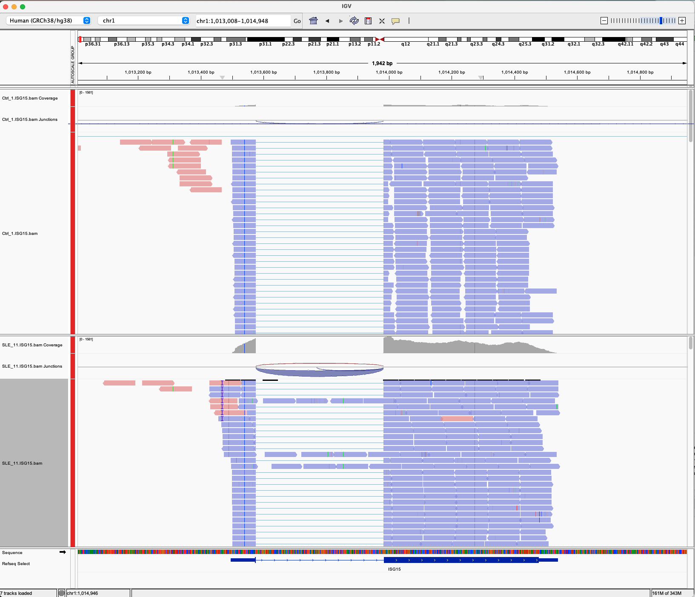
```


This IGV snapshot clearly shows increased read coverage over ISG15 in the SLE_11 sample compared to Ctrl_1, consistent with our earlier findings from `DESeq2` and the `plotCounts` function. The denser and more extensive read coverage in SLE_11 confirms upregulated expression of ISG15 in SLE CD4+ T cells, visually validating the quantitative differential expression results. Junction reads (displayed as arcs) are also more prominent in the SLE sample, indicating increased transcriptional activity and splicing across exons. These findings reinforce the role of ISG15 in the type I interferon response and its dysregulation in SLE pathogenesis, supporting both our hypothesis and previous literature linking interferon signaling to autoimmune disease activity.

## Discussion

### Biological Interpretation
This analysis of CD4⁺ T cell RNA-seq data from patients with systemic lupus erythematosus (SLE) and healthy controls revealed several compelling transcriptional patterns that reinforce the hypothesis and existing biological understanding of the disease. One of the most prominent findings was the strong upregulation of type I interferon-stimulated genes (ISGs), including ISG15, IFI44, IFI44L, and USP18. These genes were among the top differentially expressed candidates, and their elevated expression in SLE samples is consistent with the well-established type I interferon (IFN-I) signature that characterizes immune dysregulation in SLE. Type I interferons play a central role in lupus pathogenesis by promoting autoantibody production, enhancing antigen presentation, and priming autoreactive T and B cells for activation[^1].

Moreover, gene ontology enrichment analysis using clusterProfiler and visualization with REVIGO revealed that, in addition to interferon signaling, differentially expressed genes were significantly enriched in cell cycle–related processes such as mitotic cell cycle, chromosome organization, and cell cycle phase transition. These findings may reflect heightened activation or proliferative states of circulating CD4⁺ T cells in SLE patients. Prior studies have shown that SLE T-cells can adopt hyperactivated phenotypes, marked by increased metabolic demands, cell cycling, and resistance to apoptosis[^2]. This dysregulated activation may contribute to chronic immune stimulation and tissue damage, further perpetuating the disease process. Together, the enrichment in both IFN-response and cell cycle pathways underscores the complex interplay between external inflammatory signals and intrinsic cellular programming in SLE CD4⁺ T cells.

[^1]: Postal, M., Vivaldo, J. F., Fernandez-Ruiz, R., Paredes, J. L., Appenzeller, S., & Niewold, T. B. (2020). Type I interferon in the pathogenesis of systemic lupus erythematosus. Current opinion in immunology, 67, 87–94. https://doi.org/10.1016/j.coi.2020.10.014

[^2]: Hao Li, Afroditi Boulougoura, Yushiro Endo, George C. Tsokos, Abnormalities of T cells in systemic lupus erythematosus: new insights in pathogenesis and therapeutic strategies, Journal of Autoimmunity, Volume 132, 2022, 102870, ISSN 0896-8411, https://doi.org/10.1016/j.jaut.2022.102870.

### Challenges

Several technical challenges emerged during the execution of this project, many of which offered learning opportunities. One of the earliest issues stemmed from the stringency of the STAR alignment parameters, particularly the use of --outFilterMultimapNmax 1, which discards any reads that map to more than one genomic location. While this ensures high-confidence alignments, it is overly conservative for transcriptomic data, where multimapping often reflects biological realities such as gene families, pseudogenes, or paralogs. A more nuanced approach would be to retain multimappers and allow downstream tools (e.g., feature quantifiers or statistical models) to handle them appropriately.

Another significant oversight occurred during the initial run of featureCounts, where I failed to include the --countReadPairs flag. This led to an overestimation of counts by roughly a factor of two, since paired-end reads were counted individually rather than as fragments. I later reran the analysis with the correct flag, ensuring accurate fragment-level quantification. Similarly, I initially neglected to specify the library strandedness using the -s flag in featureCounts, even though the library preparation protocol (TruSeq Stranded mRNA) produces strand-specific data. After identifying this, I corrected the command to use -s 2, ensuring reads were assigned to the correct strand, which is crucial for avoiding ambiguous gene assignments, especially in densely transcribed regions.

Other challenges included handling Ensembl version numbers, which had to be stripped from gene IDs to maintain compatibility across annotation and enrichment tools, and managing inconsistencies in file naming that complicated batch processing scripts. The task was also very computationally expensive, as the samples were deep and many reads needed to be processed. Lastly, the sample size was relatively small, and it would have been helpful to have visibility on the severity of disease for the SLE patients.

### Future Directions

This project opens the door to several valuable avenues for future exploration. One  extension would be to perform GSEA analysis using full ranked gene list to capture subtle trends missed by threshold-based approaches. Another idea is performing differential transcript usage analysis to assess changes at the isoform level, using tools like DEXSeq. These methods could uncover alternative splicing patterns or shifts in isoform expression that are not captured by gene-level analyses. Another promising direction is to stratify SLE patients based on disease severity, treatment status, or other clinical metadata, which could help pinpoint expression signatures associated with flare versus remission or response to therapy. The dataset included 16 samples from patients with less active SLE, so this could certainly be incorporated in a future iteration.

Incorporating single-cell RNA-seq data could also offer more granular insights into T cell heterogeneity. Additionally, integration with epigenomic datasets (e.g., ATAC-seq or ChIP-seq) could help link observed transcriptional changes to upstream regulatory elements and transcription factor binding dynamics. Additionally, it would be helpful to explore the possibility of integrating with other SLE datasets to validate findings and explore broader immune cell involvement (e.g., CD8+, monocytes). Finally, future work could include machine learning approaches to identify gene expression patterns predictive of disease subtype, treatment response, or prognosis.

### Conclusion

In conclusion, this project successfully employed RNA-seq analysis to characterize gene expression differences in CD4⁺ T cells between SLE patients and healthy controls. The results supported the hypothesis and revealed a robust type I interferon signature and activation of cell cycle–related pathways in lupus CD4⁺ T cells, both of which are consistent with previous reports and known disease mechanisms. Despite several technical challenges, careful quality control and methodological revisions helped ensure the reliability of the results. The insights gained here provide a foundation for deeper mechanistic investigations into T cell dysfunction in SLE and support the ongoing development of transcriptomic biomarkers for autoimmune disease monitoring and treatment.

